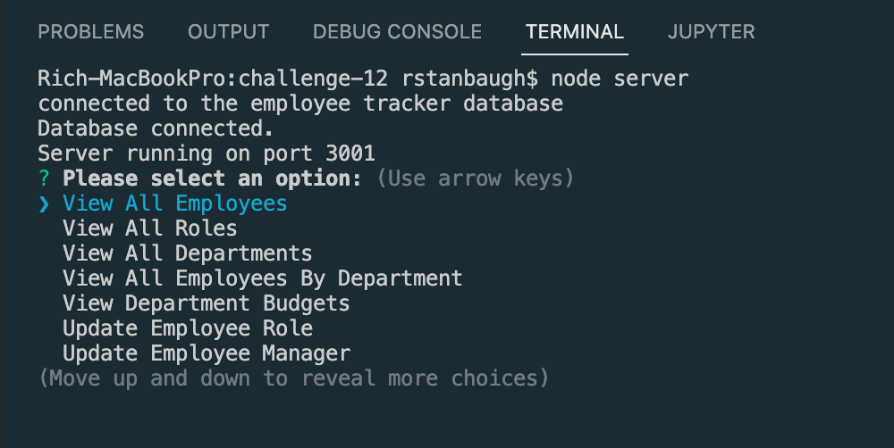

<h1 align="center">Employee Tracker - CMS</h1>
<h2 align="center">Using MySQL, Inquirer, Console.Table and Node.js 👋</h2>
<br>
  
   
## Description

A node.js application that uses user input from inquirer to populate a MySQL employee tracker database displaying employees of a company.


  
  
  ## Table of Contents
  - [Description](#description)
  - [Video Walkthrough](#walkthrough)
  - [Installation](#installation)
  - [User Story](#usage)
  - [License](#license)
  - [Contributors](#contributors)
  - [Testing](#testing)
  - [Questions](#questions)
  

  ## Video Walkthrough
  [Original Video Walkthrough](https://drive.google.com/file/d/1QCzWoaJYWWbQvperTpMZz422nWfcUTaY/view)

  [Re-submission Video Walkthrough](https://drive.google.com/file/d/1QwUDNxEhvJo3OX8o4u61dw1feo8Khq29/view)
  
  ## Installation
  `npm install from the project directory` <br/><br/>

  ## User Story

```
AS A business owner
I WANT to be able to view and manage the departments, roles, and employees in my company
SO THAT I can organize and plan my business
```
  
## Acceptance Criteria
  
``` 
GIVEN a command-line application that accepts user input
WHEN I start the application
THEN I am presented with the following options: view all departments, view all roles, view all employees, add a department, add a role, add an employee, and update an employee role
WHEN I choose to view all departments
THEN I am presented with a formatted table showing department names and department ids
WHEN I choose to view all roles
THEN I am presented with the job title, role id, the department that role belongs to, and the salary for that role
WHEN I choose to view all employees
THEN I am presented with a formatted table showing employee data, including employee ids, first names, last names, job titles, departments, salaries, and managers that the employees report to
WHEN I choose to add a department
THEN I am prompted to enter the name of the department and that department is added to the database
WHEN I choose to add a role
THEN I am prompted to enter the name, salary, and department for the role and that role is added to the database
WHEN I choose to add an employee
THEN I am prompted to enter the employee’s first name, last name, role, and manager, and that employee is added to the database
WHEN I choose to update an employee role
THEN I am prompted to select an employee to update and their new role and this information is updated in the database
```
  
  
## Usage
💻   
  
Run the following command at the root of your project and answer the prompted questions:
  
`npm start`

## Testing
✏️

No testing is currently set up<br />


  ## Software License
  [](https://opensource.org/licenses/MIT) <br/>
  This software is licensed under the "The MIT License" license.
  https://opensource.org/licenses/MIT <br/><br/>

  ## Contributors
  Rich Stanbaugh<br/><br/>

## Questions
  If you  hvae questions, you can:
  - :eyes: Find me on GitHub: [rstanbaugh@gmail.com](https://github.com/rstanbaugh@gmail.com), or<br />
  - :email: Email me: rich_bootcamp@icloud.com<br /><br />

  _This README was generated with :heart: by [README-generator](https://github.com/rstanbaugh/README-Generator) :fire: :fire:_


